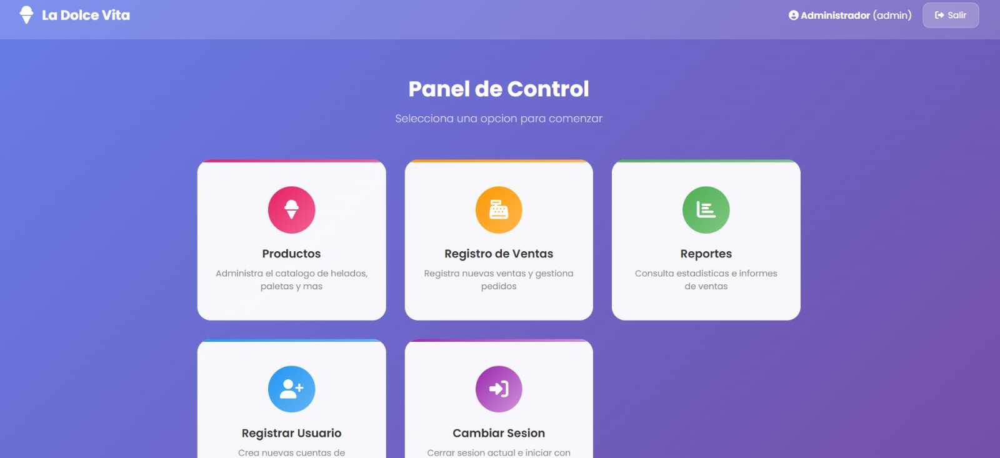
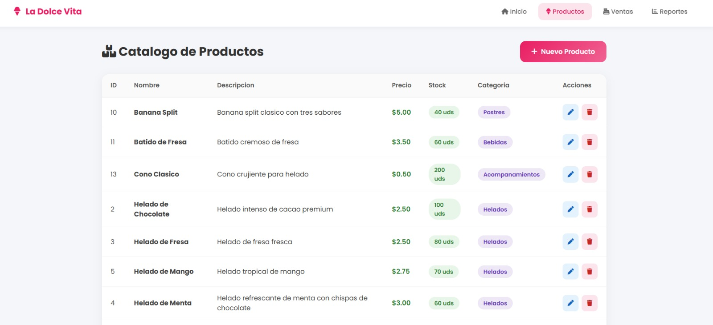
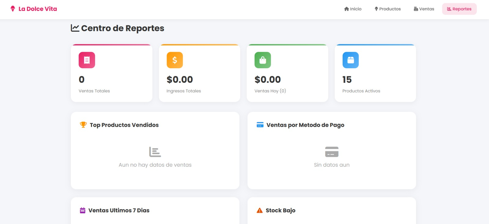
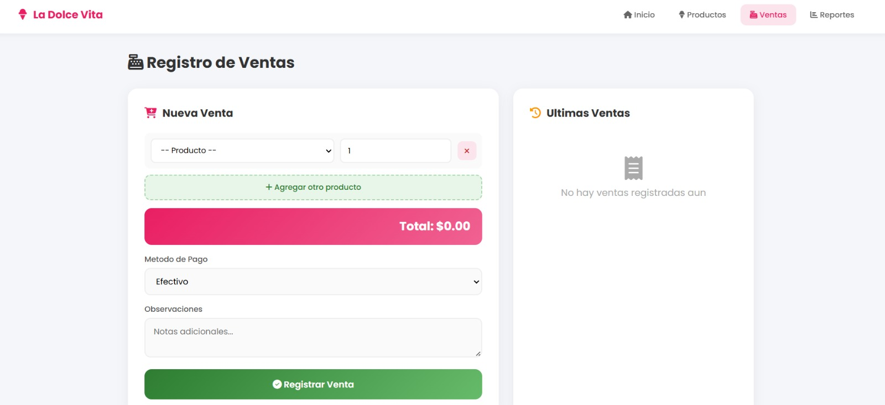

# La Dolce Vita - Heladeria Artesanal

Sistema de gestion para heladeria desarrollado con **Vue 3 + TypeScript + Vite**. Administra productos, registra ventas y visualiza reportes en tiempo real con persistencia en `localStorage`.

---

## Funcionalidades

- **Autenticacion** de usuarios (login y registro) con sesion persistente
- **Panel de control** con navegacion rapida a cada seccion
- **Catalogo de productos**: crear, editar, eliminar y visualizar productos con categorias
- **Registro de ventas**: agregar multiples productos por venta, seleccionar metodo de pago y observaciones
- **Centro de reportes**: estadisticas de ingresos, top productos, ventas por metodo de pago y alertas de stock bajo
- **Persistencia de datos** en `localStorage` (los datos se mantienen al recargar la pagina)

---

## Credenciales de prueba

| Campo       | Valor                 |
| ----------- | --------------------- |
| Correo      | `admin@heladeria.com` |
| Contrasena  | `admin123`            |

---

## Estructura del proyecto

```
proyecto-vue/
├── public/
├── src/
│   ├── assets/
│   │   └── main.css              # Estilos globales (Poppins, Font Awesome, reset)
│   ├── components/
│   │   ├── Modal.vue             # Componente modal reutilizable
│   │   └── TopBar.vue            # Barra de navegacion superior
│   ├── composables/
│   │   └── useStore.ts           # Store central con localStorage
│   ├── data/
│   │   └── data.json             # Datos semilla (usuarios, categorias, productos)
│   ├── router/
│   │   └── index.ts              # Rutas y guard de autenticacion
│   ├── types/
│   │   └── index.ts              # Definiciones de tipos TypeScript
│   ├── views/
│   │   ├── LoginView.vue         # Inicio de sesion
│   │   ├── RegisterView.vue      # Registro de usuarios
│   │   ├── DashboardView.vue     # Panel principal
│   │   ├── ProductosView.vue     # CRUD de productos
│   │   ├── VentasView.vue        # Registro de ventas
│   │   └── ReportesView.vue      # Centro de reportes
│   ├── App.vue                   # Componente raiz
│   └── main.ts                   # Punto de entrada
├── index.html
├── package.json
├── tsconfig.json
├── tsconfig.app.json
├── tsconfig.node.json
└── vite.config.ts
```

---

## Rutas

| Ruta           | Descripcion                    | Protegida |
| -------------- | ------------------------------ | --------- |
| `/`            | Redirige a `/login`            | No        |
| `/login`       | Inicio de sesion               | No        |
| `/register`    | Registro de usuario            | No        |
| `/dashboard`   | Panel principal                | Si        |
| `/productos`   | Catalogo de productos          | Si        |
| `/ventas`      | Registro de ventas             | Si        |
| `/reportes`    | Centro de reportes             | Si        |

---

## Stack tecnologico

- **Framework**: Vue 3.5 (Composition API + `<script setup>`)
- **Lenguaje**: TypeScript 6
- **Bundler**: Vite 8
- **Router**: Vue Router 4
- **Estilos**: CSS puro con variables y gradientes
- **Iconos**: Font Awesome 6
- **Fuente**: Poppins (Google Fonts)
- **Datos**: `localStorage` con datos semilla en `data.json`

---

## Instalacion y ejecucion

```sh
# Instalar dependencias
npm install

# Ejutar en desarrollo
npm run dev

# Verificar tipos y construir para produccion
npm run build

# Vista previa de produccion
npm run preview
```

---

## Diseno visual


- Paleta de colores rosa/rose (`#e91e63`, `#f06292`) como primario
- Gradientes suaves en fondos de login/registro
- Tarjetas con bordes redondeados (16-20px) y sombras sutiles
- Topbar fija con navegacion horizontal
- Modales animados con transiciones
- Badges de colores para categorias y metodos de pago
- Diseno responsive con breakpoints para moviles

---

## Wireframes y Mockups

### Inicio de Sesion


### Registro de Usuario


### Panel Principal



### Catalogo de Productos



### Reportes



### Ventas



---

## Notas

- Los datos se almacenan localmente en `localStorage`. Limpiar el almacenamiento del navegador para reiniciar los datos.
- La contraseña se guarda en texto plano (proyecto academico sin backend real).
- La sesion se mantiene en `sessionStorage` y se pierde al cerrar el navegador.

---

*Proyecto realizado por el grupo 404*
